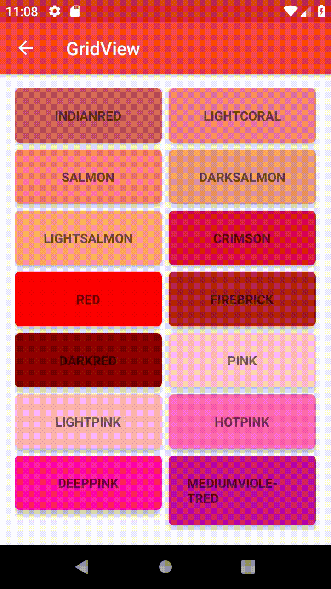

# Projet application android

**Titre :** NDrawer  
**Auteur :** Nicolas Rochette  
**Auteur du Readme :** Nicolas Rochette  
**Résumé du projet :** mettre en pratique tout ou en partie, les éléments abordés pendant les séances de programmation Android.   
Ce projet peut être démarré à partir de l’application construite dans le cadre du TD/TP 4 : Réaliser une interface utilisateur native. Cette dernière comporte un menu latéral mettant en oeuvre des *Fragments* et des *Activities*. L’objectif est de créer un application vitrine des développements mis en pratique durant les séances d’Android.  
**Technologies utilisées  :** Android Studio - Kotlin  
**Requis :** Android studio  


**Installation :**   
  - [Lien de Telechargement](https://github.com/rn605435/Androidproject/archive/master.zip)  ou executer la commande :  ```git clone https://github.com/rn605435/Androidproject.git```
  - Décompresser le dossier .zip  
  - Ouvrir Android Studio  
  - Fichier > Ouvrir > Androidproject  

# Description de l'application  

L’application comporte un écran principal. Ce dernier présente un menu latéral ainsi qu’un menu dans la barre de l’application.  
Les différents éléments de menus pointent vers des écrans de l’application :  

 - Accueil présentant une image et 2 boutons.  
 - Cardview présentant une liste de *cardview* générée à l'aide d'une *data class*.  
 - Cercle magique présentant un cercle en mouvement qui rebondit sur les bords de l'écran.  
 - Number picker présentant un élément graphique de type number picker.  
 - Anko présentant une fonctionnalité de la bibliothèque Anko.  
 - GridView présentant un layout de type gridview à l'intérieur duquel on trouve des cardview qui changent la couleur du fond programmatiquement.  
 - Citation, situé à droite dans la barre du haut, présentant une citation au hasard ainsi que l'auteur de la citation, appelé à l'aide d'une requête asynchrone sur une api externe.  

Les éléments Citation, Anko et GridView sont des activités tandis que tous les autres sont des fragments de l'activity appelée MainActivity.  

## Impression d'écran  
*Ecran d'accueil*  
  
*Ecran Cardview*  
  
*Ecran Cercle Magique*  
    
*Ecran Number Picker*  
    
*Ecran Anko*  
  
*Ecran GridView*  
  
*Ecran Citation*  
  
 

## Description des impressions d'écrans  

### Accueil   
L'écran d'accueil possède deux boutons l'un ouvre le menu, l'autre permet de quitter l'application via l'utilisation d'*AlertDialog*.  

### Cardview. 
Le fragment contient un recyclerview remplit programmatiquement via l'adapteur *CustomAdapter* qui utilise le pattern ViewHolder, et où on y lie les références des objets entre la *data class Language* et le *recyclerview*
Par défaut dans le constructeur de la data class on y passe des paramètres qui sont affichées par défaut lorsque le ViewHolder ne trouve pas de valeurs.  
Chaque cardview est cliquable et le nom du langage est affiché à l'aide d'un *toast*.  

### Cercle Magique. 
Le fragment contient un cercle animé qui rebondit dans l'espace de l'écran du téléphone.   Le cercle est construit dans la *data class Magic Circle* et est dessiné dans la class *CustomView*, on peut changer son emplacement grâce à la méthode *OnTouchEvent* qui permet de le redessiner à la position touchée.  

### Number Picker. 
Le fragment contient un simple number picker initialisé à travers la méthode *OnViewCreated* du fragment.  

### Anko  
Nouvelle activité qui hérite d'ankologger pour bénéficier des fonctionnalités de la bibliothèque Anko importé dans les dépendances. Le bouton montre la méthode de toast de la bibliothèque lors d'un événement click.  

### GridView. 
On initialise les dimension de la gridview à la création de l'activité. La gridview utilise également un adapter *ColorBaseAdapter* qui la remplit. L'adapter contient une liste contenant le nom et la valeur de la couleur, et la méthode *getView* remplit la grille en prenant le nom de la couleur et en appliquant sa valeur au background de l'item.  
On capte également l'évènement click sur chaque item pour afficher dynamiquement le nom de l'item cliqué et changer le background du fragment avec sa valeur.  

### Citation   
L'activité citation est accessible via l'icone *"* de la barre du haut, à chaque entrée dans l'activité on fait une requête à une API fournissant des citations et leurs auteurs de manière asynchrone. On utilise la méthode *doAsync* d'Anko de cette façon :   
```kotlin
doAsync {
    var result = runLongTask()
    uiThread {
        toast(result)
    }
}
```
afin de ne pas bloquer le thread principal. L'api nous fournit un json que l'on lit avec *json.string*, le texte est ensuite donné aux textview pour l'afficher dans le layout de l'activité.  
De cette façon à chaque fois que l'on rentre dans cette activité une nouvelle citation nous est donné.  

## Remarque d'ensemble sur le code    

La méthode Onbackpressed a été surchargée afin de ne pas sortir de l'application lorsque l'on appuie sur le bouton retour d'un fragment de l'activité. Lorsque l'on va dans une nouvelle activité comme Citation, ou Anko, les méthodes *setDisplayHomeAsUpEnabled* et *setDisplayShowHomeEnabled* sont utilisées pour afficher la flèche de retour dans la barre du haut et on utilise la méthode *OnSupportNavigateUp* pour retourner à l'activité précédente.   

Les traductions de toutes les strings des layouts on était traduites en anglais, l'application est donc traduite lorsque l'on met la langue de l'appareil en anglais.

Plusieurs thèmes sont utilisés les couleurs changent dans les différentes activités grâce à la méthode *setTheme*.
