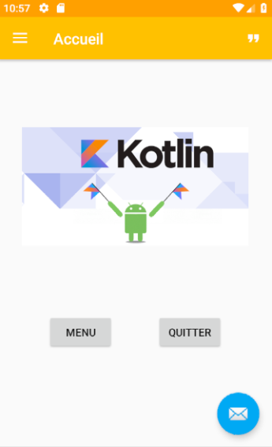
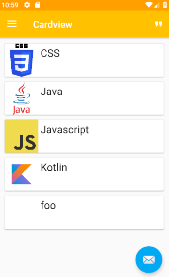
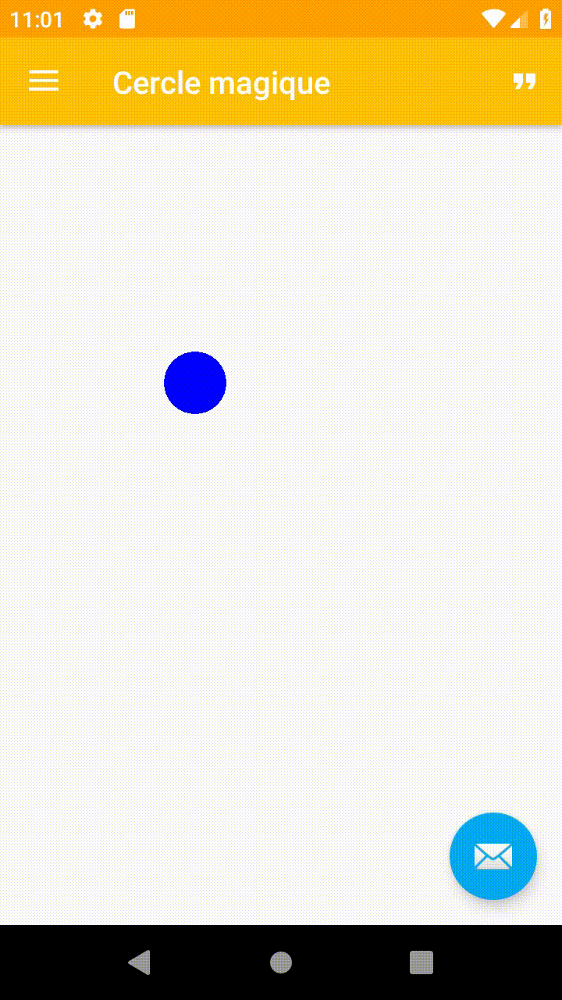
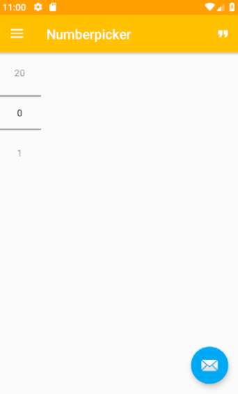
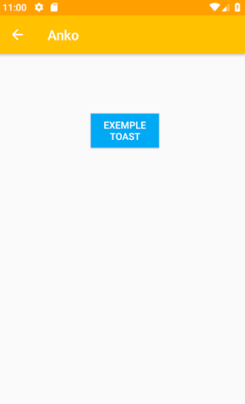
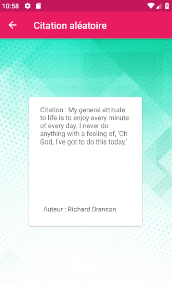

# Projet application android

**Titre :** NDrawer  
**Auteur :** Nicolas Rochette  
**Auteur du Readme :** Nicolas Rochette  
**Résumé du projet :** mettre en pratique tout ou en partie, les éléments abordés pendant les séances de programmation Android.   
Ce projet peut être démarrer à partir de l’application construite dans le cadre du TD/TP 4 : Réaliser une interface utilisateur native. Cette dernière comporte un menu latéral mettant en oeuvre des *Fragments* et des *Activities*. L’objectif est de créer un application vitrine des développements mis en pratique durant les séances d’Android.  
**Technologies utilisées  :** Android Studio - Kotlin  
**Requis :** Android studio  

**Installation :**   
  - [Lien de Telechargement](https://github.com/rn605435/Androidproject/archive/master.zip)  
  - Décompresser le dossier .zip  
  - Ouvrir Android Studio  
  - Fichier > Ouvrir > Androidproject  

# Description de l'application  

L’application comporte un écran principal. Ce dernier présente un menu latéral ainsi qu’un menu dans la barre de l’application.  
Les différents éléments de menus pointent vers des écrans de l’application :  

 - Accueil présentant une image et 2 boutons.  
 - Cardview présentant une liste de *cardview* généré à l'aide d'une *data class*.  
 - Cercle magique présentant un cercle en mouvement qui rebondit sur les bords de l'écran.  
 - Number picker présentant un élément graphique de type number picker.  
 - Anko présentant une fonctionnalité de la bibliothèque Anko.  
 - GridView présentant un layout de type gridview à l'intérieur duquel on trouve des cardview qui change la couleur du fond programmatiquement.  
 - Citation, situé à droite dans la barre du haut, présentant une citation au hasard ainsi que l'auteur de la citation, appelé à l'aide d'une requête asynchrone sur une api externe.  

Les éléments Citation, Anko et GridView sont des activités tandis que tous les autres sont des fragments de l'activity appelée MainActivity.  

## Impression d'écran  

*Ecran d'accueil*  

*Ecran Cardview*  
  
*Ecran Cercle Magique*  
  
*Ecran Number Picker*  

*Ecran Anko*  

*Ecran GridView*  

*Ecran Citation*  

## Description des impressions d'écrans  

The file explorer is accessible using the button in left corner of the navigation bar. You can create a new file by clicking the **New file** button in the file explorer. You can also create folders by clicking the **New folder** button.

## Remarque d'ensemble sur le code  

You can rename the current file by clicking the file name in the navigation bar or by clicking the **Rename** button in the file explorer.
